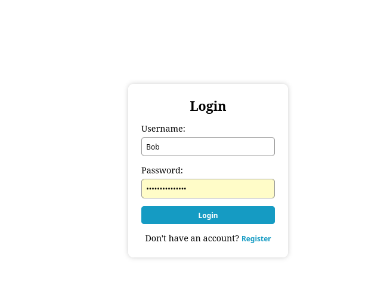
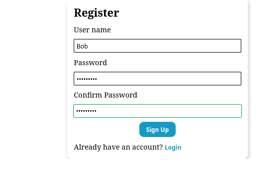
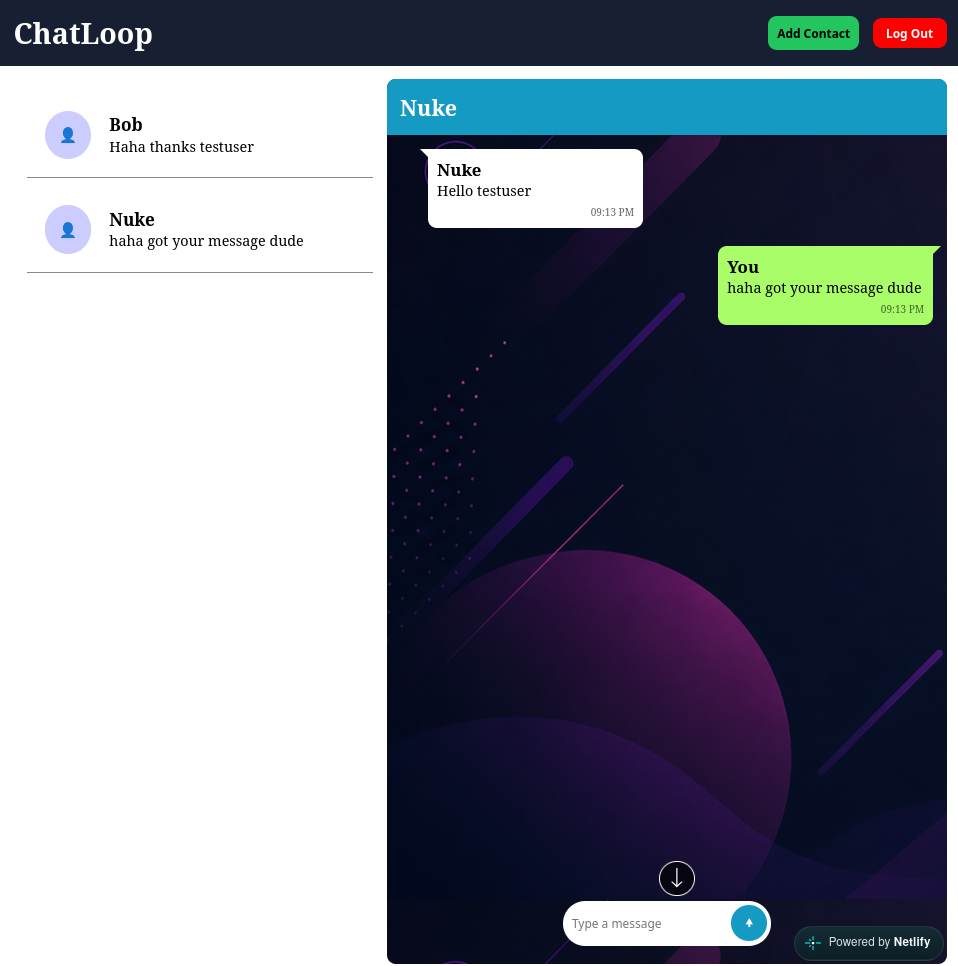
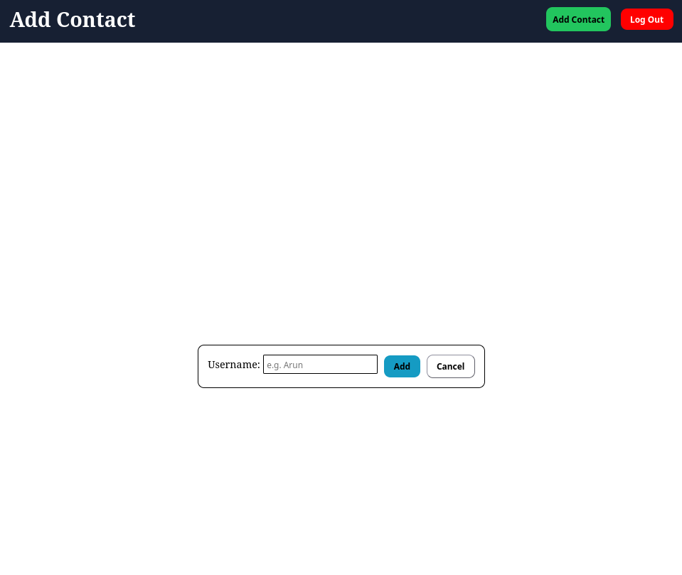

# ChatLoop 💬

ChatLoop is a full-stack real-time-style chat application built using **Vue.js**, **Spring Boot**, and **MongoDB Atlas**.

The application allows users to register, log in, add contacts, and exchange messages with their contacts through a simple and responsive chat interface.

## 🚀 Live Demo

**Frontend:**  
https://chatloop-web.netlify.app/

**Backend:**  
https://chat-app-backend-9mfo.onrender.com

## ✨ Features

- 👤 User registration
- 🔐 User login
- 👥 Add contacts
- 🔄 Automatically create mutual contacts
- 💬 Send messages
- 📜 Load previous conversations
- 🕐 Display message time
- 📱 Responsive mobile chat interface
- 🔙 Mobile back button for conversations
- ☁️ MongoDB Atlas database
- 🌐 Deployed frontend and backend
## 📸 Screenshots

### 🔐 Authentication

<p align="center">
  
  
</p>

### 💬 Chat Interface

<p align="center">
  
  
</p>

## 🛠️ Technologies Used

### Frontend

- Vue.js
- HTML
- CSS
- JavaScript
- Vite
- Fetch API

### Backend

- Java
- Spring Boot
- Spring Data MongoDB
- Maven
- REST API

### Database

- MongoDB Atlas

### Deployment

- Netlify — Frontend
- Render — Backend
- MongoDB Atlas — Database
- GitHub — Source Code

## 🏗️ Project Architecture

```text
                    ┌──────────────────┐
                    │     Browser      │
                    │    Vue.js App    │
                    └────────┬─────────┘
                             │
                             │ REST API
                             ▼
                    ┌──────────────────┐
                    │      Render      │
                    │  Spring Boot API │
                    └────────┬─────────┘
                             │
                             │ MongoDB Driver
                             ▼
                    ┌──────────────────┐
                    │   MongoDB Atlas  │
                    │    Database      │
                    └──────────────────┘
```

## 📂 Project Structure

```text
chat-app/
│
├── backend/
│   ├── src/
│   │   └── main/
│   │       ├── java/com/example/backend/
│   │       │   ├── controller/
│   │       │   │   ├── ChatController.java
│   │       │   │   ├── ContactController.java
│   │       │   │   └── UserController.java
│   │       │   │
│   │       │   ├── model/
│   │       │   ├── repository/
│   │       │   └── service/
│   │       │
│   │       └── resources/
│   │           └── application.properties
│   │
│   ├── pom.xml
│   └── Dockerfile
│
└── frontend/
    ├── src/
    │   ├── components/
    │   │   ├── Login.vue
    │   │   ├── Register.vue
    │   │   ├── Contacts.vue
    │   │   ├── AddContact.vue
    │   │   └── ChatWindow.vue
    │   │
    │   ├── App.vue
    │   ├── main.js
    │   └── assets/
    │
    ├── package.json
    └── vite.config.js
```

## 🔌 API Endpoints

### Users

| Method | Endpoint           | Description         |
| ------ | ------------------ | ------------------- |
| POST   | `/api/users`       | Register a new user |
| POST   | `/api/users/login` | Login user          |

### Contacts

| Method | Endpoint                | Description         |
| ------ | ----------------------- | ------------------- |
| POST   | `/api/contacts`         | Add a contact       |
| GET    | `/api/contacts/{owner}` | Get user's contacts |

### Chat

| Method | Endpoint                        | Description      |
| ------ | ------------------------------- | ---------------- |
| POST   | `/api/chat`                     | Send a message   |
| GET    | `/api/chat/{sender}/{receiver}` | Get conversation |

## 🗄️ Database Collections

ChatLoop uses MongoDB Atlas with the following collections:

```text
users
contacts
chat
```

### Users

Stores registered user information.

### Contacts

Stores the relationship between users and their contacts.

### Chat

Stores messages exchanged between users.

## ⚙️ Running Locally

### 1. Clone the repository

```bash
git clone https://github.com/KJayasuriya/chat-app.git
cd chat-app
```

### 2. Start the backend

```bash
cd backend
./mvnw spring-boot:run
```

The backend runs on:

```text
http://localhost:8080
```

### 3. Configure MongoDB

Set the MongoDB connection string as an environment variable:

```bash
export MONGODB_URI="your-mongodb-connection-string"
```

The backend uses:

```properties
spring.mongodb.uri=${MONGODB_URI}
server.port=${PORT:8080}
server.address=0.0.0.0
```

### 4. Start the frontend

Open another terminal:

```bash
cd frontend
npm install
npm run dev
```

The frontend will normally be available at:

```text
http://localhost:5173
```

## 🔐 Authentication

The current version uses a simple username/password login system intended for learning and demonstration purposes.

It does **not** currently implement JWT authentication, password hashing, sessions, or OAuth.

For a production application, proper authentication and password security should be implemented.

## 🌐 Deployment

The project is deployed using:

```text
GitHub
   │
   ├── Frontend → Netlify
   │
   └── Backend → Render
                    │
                    ▼
               MongoDB Atlas
```

The frontend communicates with the deployed Spring Boot REST API using HTTP requests.

CORS is configured in the backend to allow requests from the deployed frontend.

## 🔮 Future Improvements

The following features can be added in future versions:

### 🗑️ Delete Messages

Allow users to delete individual messages from a conversation.

Possible improvements:

* Delete a single message
* Delete messages only for yourself
* Delete messages for both users
* Add a confirmation dialog before deletion

### 👥 Delete Contacts

Allow users to remove contacts from their contact list.

Possible improvements:

* Remove a contact
* Automatically remove the reverse contact
* Confirmation before deleting a contact

### 🔐 Better Authentication

* Password hashing
* JWT authentication
* Secure sessions
* Logout/token expiration
* Protected API endpoints

### 🟢 Online Status

Show whether a contact is:

* Online
* Offline
* Last seen

### 🔔 Unread Messages

Add unread message indicators and message counts to contacts.

### 🔍 Contact Search

Allow users to search their contacts quickly.

### ✏️ Edit Messages

Allow users to edit messages after sending them.

### 📎 File Sharing

Allow users to send:

* Images
* Documents
* Files

### 😊 Emoji Support

Add an emoji picker to the message input.

### 🔄 Real-Time Messaging

Replace normal REST-based message loading with:

* WebSockets
* STOMP
* Server-Sent Events

This would allow messages to appear instantly without refreshing or manually loading conversations.

## 📌 Known Limitations

* Authentication is currently basic.
* Passwords are not hashed.
* Messages are loaded through REST requests rather than a real-time connection.
* No message deletion is currently implemented.
* No contact deletion is currently implemented.
* No file/image sharing.
* No online/offline status.

## 🎯 Purpose of the Project

This project was created to learn and demonstrate full-stack web development using:

```text
Vue.js
   +
Spring Boot
   +
MongoDB
```

It demonstrates how a modern frontend communicates with a backend REST API and how the backend interacts with a cloud-hosted NoSQL database.

## 👨‍💻 Author

**KJayasuriya**

GitHub: [KJayasuriya](https://github.com/KJayasuriya)

---

